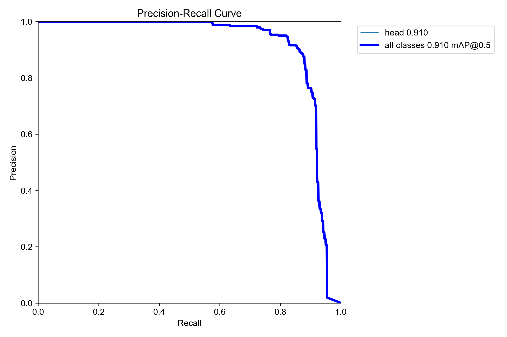
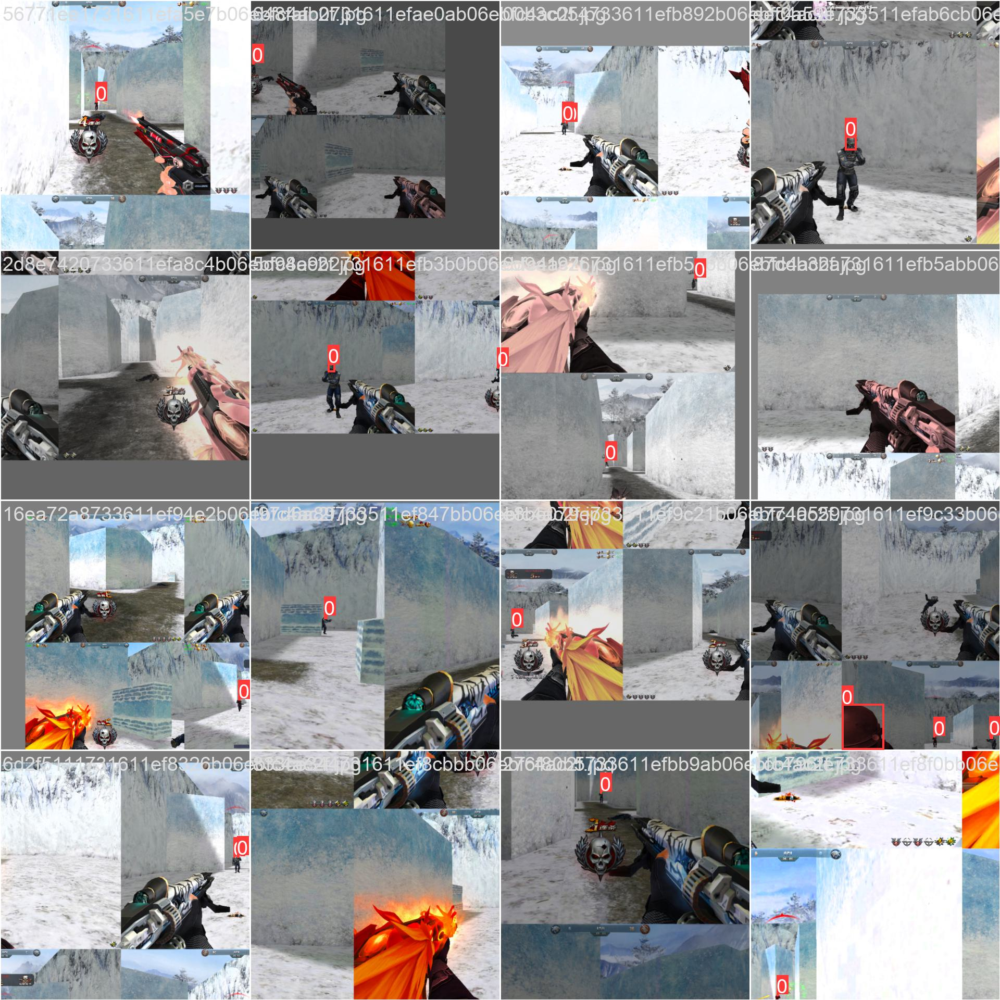
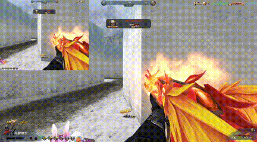

# 基于yolov5模型实现FPS游戏自瞄

## 启动方式
```bash
python aiMBot.py
```
配置需要修改aiMBot.py文件

## 模型训练
```bash
# 训练一个普通的模型
python train.py --weights yolov5s --data data/ssjj.yaml
# 在训练完毕的模型上训练稀疏模型
python train_sparity.py --weights runs/train/exp/weights/best.pt
# 对稀疏模型剪枝，0.5裁剪率，采用L1范数
python prune.py --source runs/train/exp2/weights/best.pt --pruning_ratio 0.5 --norm 1
# 模型剪枝后性能很差，需要模型康复训练
# YOLOv5的框架train.py默认会先读取模型配置文件，将模型的参数导入进去，导致剪枝后的模型被破坏
# 使用only_weight只使用模型中的结构，不读取配置文件，no_sparse关闭稀疏训练，也可以不关闭，采用逐步稀疏剪枝
python train_sparity.py --weights runs/train/exp2/weights/best_pruned.pt --only_weight --no_sparse
# 确定模型训练完毕后，将模型转为ONNX
python export.py --weights runs/train/exp2/weights/best_pruned.pt --include onnx --simplify
# 模型量化
python quantization.py --source runs/train/exp2/weights/best_pruned.onnx
```

## 模型调优

量化之后的模型性能损失比较严重
```bash
# 
python run_qdq_debug.py 
--float_model runs/train/exp2/weights/best_pruned.pt 
--qdq_model runs/train/exp2/weights/best_pruned.onnx
--calibrate_dataset datasets/ssjj
```

## 项目介绍
项目为[yolov5](https://github.com/ultralytics/yolov5)项目基础上进行开发，源码仅供用于学习研究，不可用于非法用途。

~~实际并没啥用，移动自瞄效果不好~~








本测试均在人机对战模式下测试