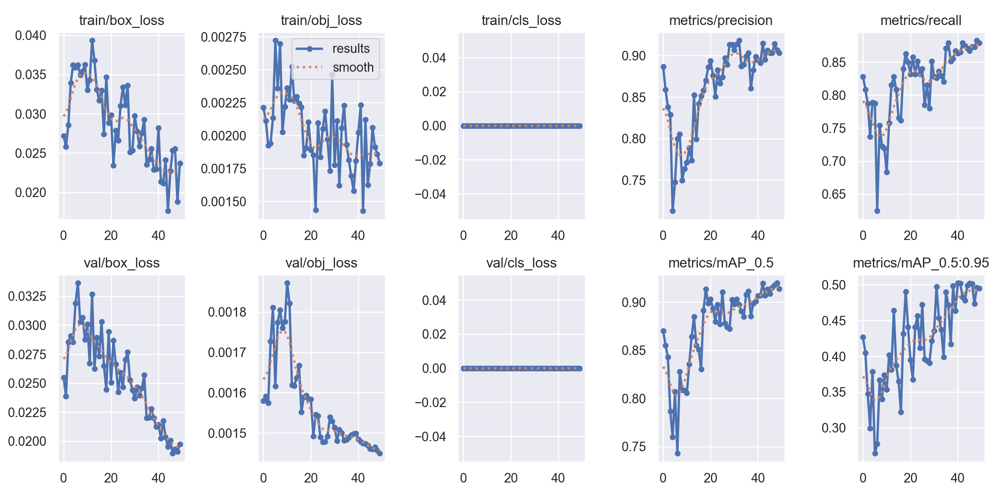

# 基于yolov5模型实现FPS游戏自瞄

## 启动方式
```bash
python aiMBot.py
```
配置需要修改aiMBot.py文件

## 项目介绍
项目为[yolov5](https://github.com/ultralytics/yolov5)项目基础上进行开发，源码仅供用于学习研究，不可用于非法用途。

~~实际并没啥用，移动自瞄效果不好~~





本模型测试均在人机对战下测试